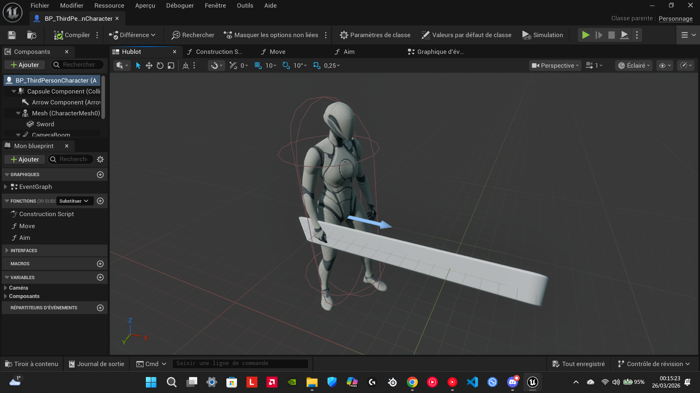
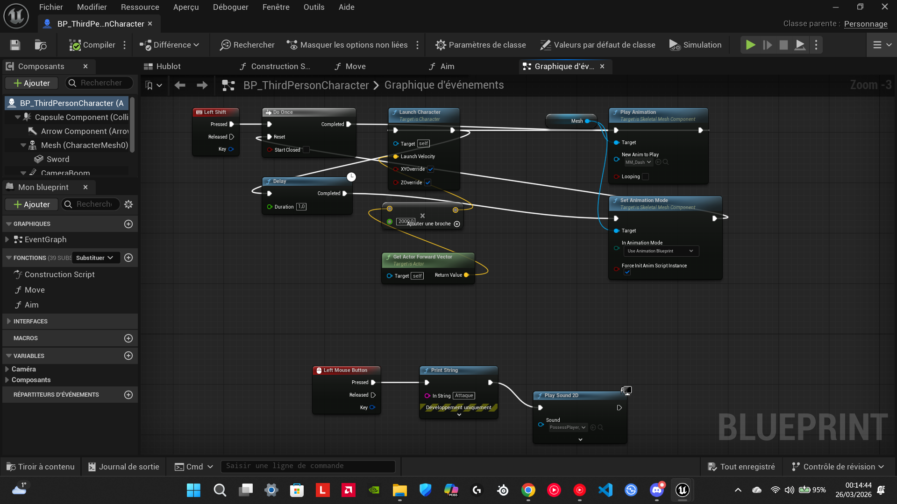
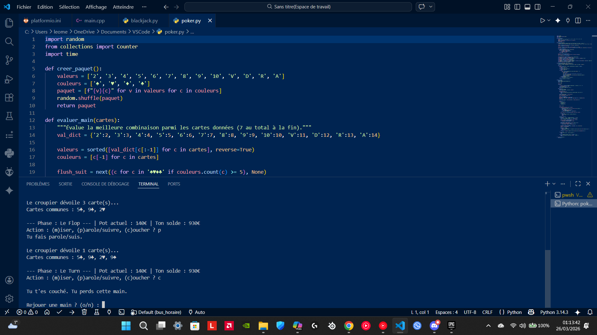
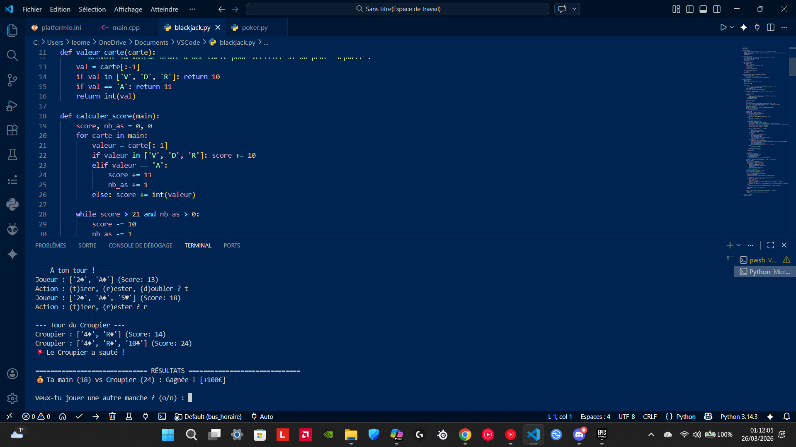
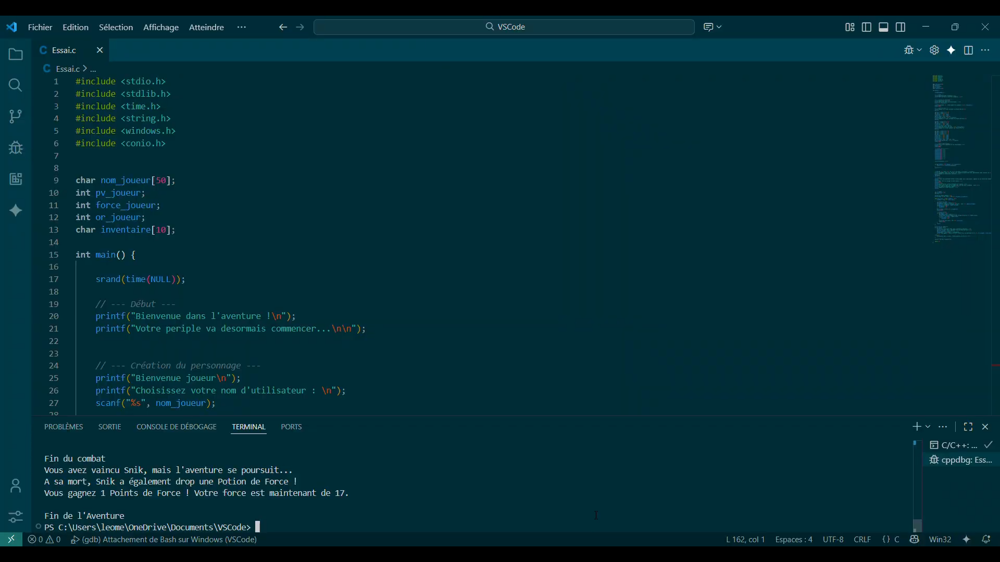

# 👋 Salut, moi c'est Léo !

[cite_start]Étudiant passionné par le développement et les nouvelles technologies, originaire d'Annecy[cite: 1, 2, 5]. [cite_start]Mon ambition est de me perfectionner en programmation pour créer des expériences numériques innovantes[cite: 4].

---

## 🛠 Compétences
- [cite_start]**Langages :** Python, C++, C [cite: 9]
- [cite_start]**Moteur de jeu :** Unreal Engine 5 (Blueprints) [cite: 13]
- [cite_start]**Intérêts :** Intelligence Artificielle, Développement de jeux vidéo [cite: 10]

---

## 🚀 Mes Projets

### 🎮 Projet Dauntless (Unreal Engine 5)
[cite_start]Reproduction du jeu Dauntless pour m'exercer sur les systèmes complexes de l'UE5 et le langage Blueprint[cite: 12, 13, 14, 15].

> **🎥 [Clique ici pour voir la vidéo de démonstration](Projet_Dauntless.mp4)**

### 🃏 Projet Casino (Python)
[cite_start]Développement de programmes permettant de jouer au Poker et au Blackjack[cite: 16, 17, 18, 19].

### 📚 Aventure Textuelle (Langage C)
[cite_start]Création d'un "livre dont vous êtes le héros" dans le cadre d'un projet scolaire[cite: 20, 21].

---

## 📫 Me contacter
- [cite_start]📧 Email : leomessire5o@gmail.com [cite: 23]
