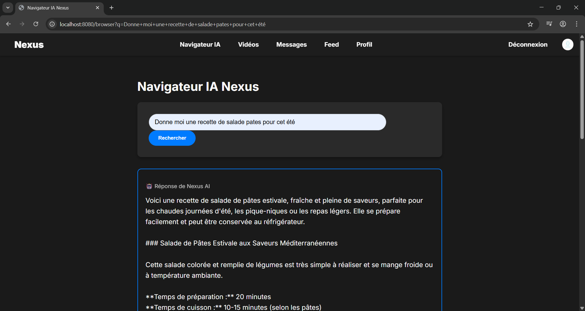
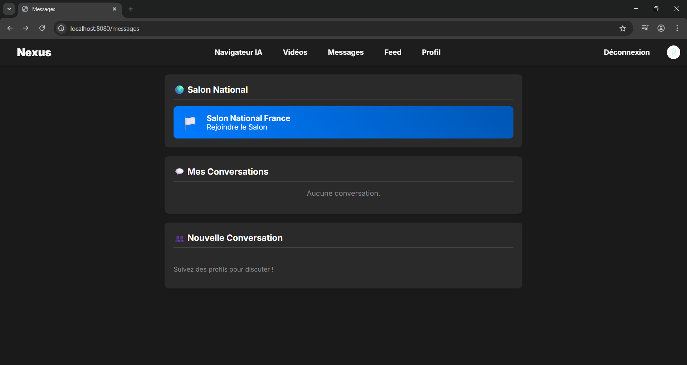
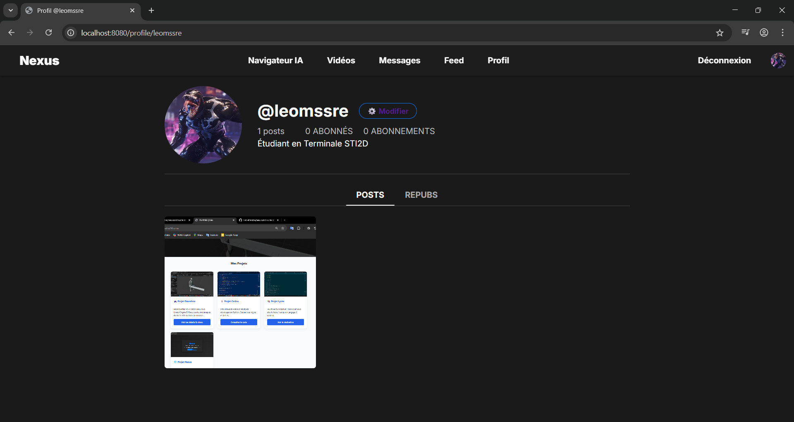

# 🌐 Projet Nexus : Écosystème de Navigation IA

### Présentation du Concept
Nexus n'est pas seulement un navigateur, c'est un assistant intelligent conçu pour centraliser vos interactions numériques. Ce projet explore l'intégration de l'IA au cœur de la navigation quotidienne. (le projet a été hébergé sur un serveur local)

---

### 🔑 Interface de Connexion
L'accès à l'écosystème Nexus est sécurisé par une interface moderne, point d'entrée vers la personnalisation de l'IA.

### 🌍 Le Navigateur IA
Le cœur du projet : une barre de navigation intelligente capable de comprendre le contexte des recherches.

### 💬 Système de Conversations
Une interface de chat intégrée permettant de dialoguer avec l'IA tout en naviguant, sans changer d'onglet.

### 👤 Gestion du Profil
Un espace dédié à l'utilisateur pour gérer ses préférences, modifier son profil etc.

---

### Compétences techniques démontrées
- **UI/UX Design :** Cohérence visuelle entre les différents onglets.
- **Logique Applicative :** Structure de navigation entre les modules (Connexion -> Profil -> Chat).
- **Vision Technologique :** Anticipation des usages futurs du web.

---
[⬅️ Retour à l'accueil](https://leomssre.github.io/Leo-Messire/)
