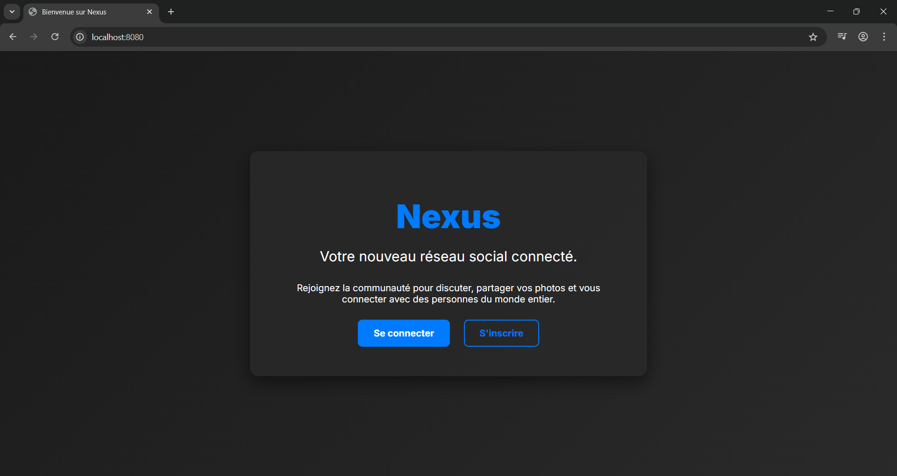

# 🌐 Projet Nexus

### Description
Le projet Nexus est une réalisation axée sur [un nouveau type de réseau social basé sur l'intelligence artificielle]. Ce projet m'a permis d'approfondir mes connaissances en [langage utilisé].

### Points clés
- **Objectif :** [Ex: Créer une plateforme de communication]
- **Technologies :** [Ex: Python, API, HTML + CSS, etc.]
- **Défi technique :** [Ex: La gestion des données en temps réel]

### Aperçu du projet

---
[⬅️ Retour à l'accueil](https://leomssre.github.io/Leo-Messire/)
